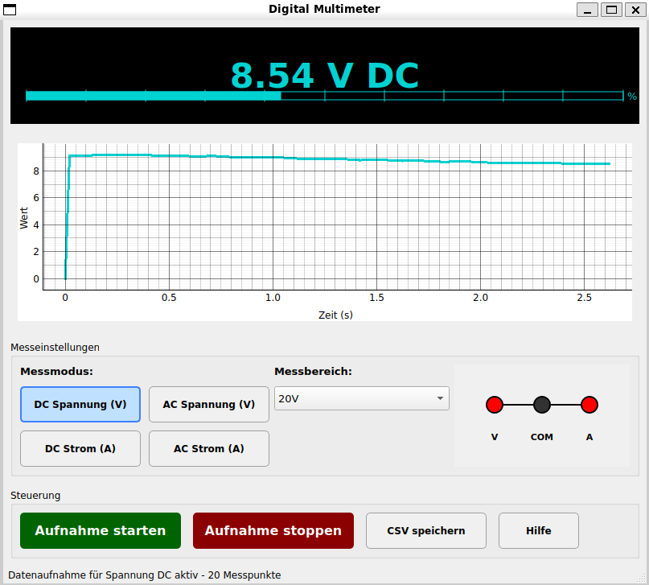
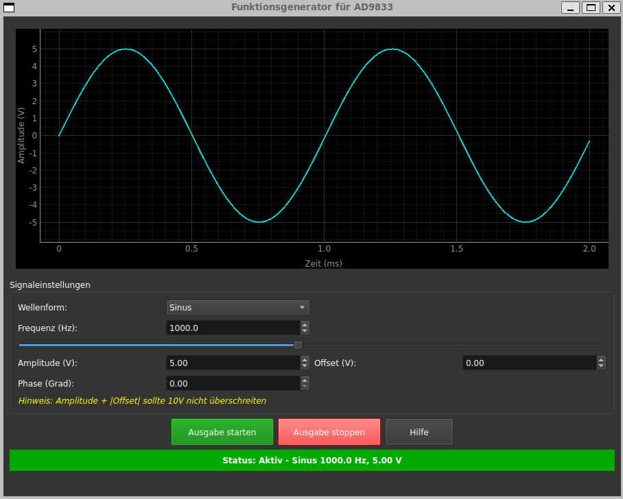
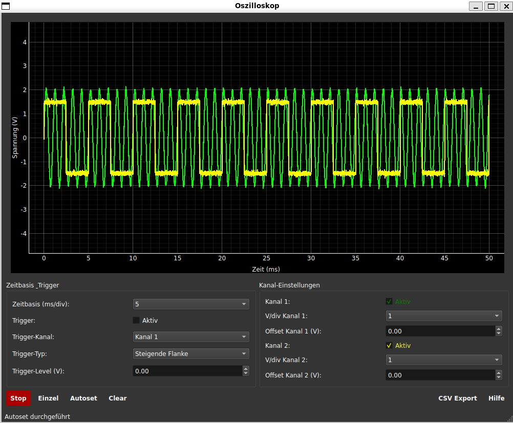

# Datenerfassungssystem auf Raspberry Pi (OurDAQ)

## Projektbeschreibung

Dieses Projekt (OurDAQ) zielt auf die Entwicklung eines prototypischen Messdatenerfassungssystems (DAQ) basierend auf `Raspberry Pi` und `Digilent MCC DAQ HAT MCC 118` ab. Das System dient als Grundlage für ein studentisches Messtechniklabor.






## Hardwareanforderungen

- `Raspberry Pi`
- `Digilent MCC DAQ HAT MCC 118`
- Externe Peripherie:
  - DAC + OPV + Mosfet für Spannungsversorgung
  - Gehäuse mit geplanten Anschlüssen und Steckern

## Softwareanforderungen

- `Linux`
- `Python 3.11+`
- `PyQt5`
- Folgende Python-Pakete:
  - `numpy`
  - `matplotlib`
  - `pandas`
  - `daqhats`
  - `mcculw`
  - `pyqtgraph`
  - `openpyxl`

## Installation

1. Update und upgrade:

   ```bash
   sudo apt update
   sudo apt full-upgrade
   sudo reboot 
   ```

2. Repository klonen:

   ```bash
   cd ~
   git clone https://github.com/MSY-Walter/OurDAQ.git
   ```

### Entwicklungsumgebung

1. Virtuelle Umgebung erstellen:

   ```bash
   cd ~/OurDAQ
   python3 -m venv .venv
   ```

2. Umgebung aktivieren:

   ```bash
   source .venv/bin/activate
   ```

3. Abhängigkeiten und Pakete installieren:

   ```bash
   sudo apt-get install python3-pyqt5
   pip install uv
   uv pip install -r requirements.txt
   ```

4. Link von der virtuellen Umgebung zum PyQt5-Systempaket erstellen, z.B.: (Hinweis: "sebastian" und "python3.11" muss angepasst werden, wie "user" und "python3.xx")

   ```bash
   ln -s /usr/lib/python3/dist-packages/PyQt5 /home/sebastian/OurDAQ/.venv/lib/python3.11/site-packages/
   ```

5. Python Programm starten

   ```bash
   python3 src/Dashboard.py
   ```

## Verwendung

Das System bietet folgende Standard-Messroutinen:

- Multimeter-Funktionalität
- Oszilloskop-Funktionalität
- Netzteil-Funktionalität
- Funktionsgenerator-Funktionalität
- Diodenkennlinie-Funktionalität
- Filterkennlinie-Funktionalität

## Projektstruktur

- `docs/`: Dokumentation
- `src/`: Quellcode-Verzeichnis
  - `resources/`: Quelle von images und icons
  - `Dashboard.py`: Hauptmenü
  - `Diodenkennlinie.py`: Dashboard für Diodenkennlinie
  - `DMM.py`: Dashboard für Digitalmultimeter
  - `Filterkennlinie.py`: Dashboard für Filterkennlinie
  - `Funktionsgenerator.py`: Dashboard zu Erzeugung der Signale
  - `Netzteil.py`: Dashboard für Netzteil
  - `Oszilloskop.py`: Dashboard für Oszilloskop
  - `Signal_Generator.py`: Datei zu Erzeugung der simulierte Signale
- `.gitignore`: Bei commit ignorieren
- `LICENSE`: MIT License
- `README.md`: Diese Datei
- `requirements.txt`: Python-Paket

## Link

[`MCC DAQ HAT Library for Raspberry Pi`](https://github.com/mccdaq/daqhats)

## Lizenz

Dieses Projekt steht unter [`MIT License`](LICENSE)
