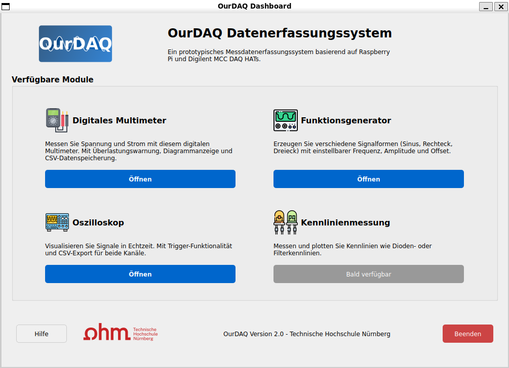

# Datenerfassungssystem auf Raspberry Pi 5 (OurDAQ)

## Projektbeschreibung

Dieses Projekt (OurDAQ) zielt auf die Entwicklung eines prototypischen Messdatenerfassungssystems (DAQ) basierend auf [`Raspberry Pi 5`](https://www.raspberrypi.com/documentation/computers/raspberry-pi.html) und [`Digilent MCC DAQ HAT MCC 118`](https://mccdaq.github.io/daqhats/overview.html#mcc-118) ab. Das System dient als Grundlage für ein studentisches Messtechniklabor.



Das System bietet folgende Standard-Messroutinen:

- Multimeter-Funktionalität
- Oszilloskop-Funktionalität
- Netzteil-Funktionalität
- Funktionsgenerator-Funktionalität
- Diodenkennlinie-Funktionalität
- Filterkennlinie-Funktionalität

## Hardwareanforderungen

- [`Raspberry Pi 5`](https://www.raspberrypi.com/documentation/computers/raspberry-pi.html)
- [`Digilent MCC DAQ HAT MCC 118`](https://mccdaq.github.io/daqhats/overview.html#mcc-118)
- Externe Peripherie:
  - DAC + OPV + Mosfet für Spannungsversorgung
  - Gehäuse mit geplanten Anschlüssen und Steckern

## Softwareanforderungen

- Linux System wie [`Raspberry Pi OS`](https://www.raspberrypi.com/software/) oder [`Ubuntu`](https://ubuntu.com/download/raspberry-pi)
- [`uv`](https://docs.astral.sh/uv/) Python-Paketemanager
- `python>=3.11`
- `PyQt5`
- Und Folgende Python-Pakete:
  - `daqhats>=1.4.1.0`
  - `dash>=3.0.4`
  - `matplotlib>=3.10.3`
  - `notebook>=7.4.2`
  - `numpy>=2.2.5`
  - `pandas>=2.2.3`
  - `pyqtgraph>=0.13.7`
  - `spidev>=3.7`

## Installation

1. uv installieren (Falls nicht vorhanden):

   ```bash
   curl -LsSf https://astral.sh/uv/install.sh | sh
   ```

2. update und upgrade:

   ```bash
   sudo apt update
   sudo apt full-upgrade
   sudo reboot
   ```

3. PyQt5-Systempaket installieren (Falls nicht vorhanden):

   ```bash
   sudo apt install python3-pyqt5
   ```

4. repository klonen:

   ```bash
   cd ~
   git clone https://github.com/MSY-Walter/OurDAQ.git
   ```

### Entwicklungsumgebung

1. Link von PyQt5-Systempaket zu der virtuellen Umgebung erstellen:

   ```bash
   cd ~/OurDAQ
   python3 -m venv --system-site-packages .venv
   ```

2. Abhängigkeiten und Pakete in der virtuellen Umgebung installieren:

   ```bash
   uv sync
   ```

## Verwendung

Hauptmenü öffnen:

```bash
uv run src/Dashboard.py
```

Bestimmte Funktionalität öffnen:

```bash
uv run src/<Dateiname>
```

In Jupyter Notebook öffnen:

```bash
uv run jupyter notebook
```

## Projektstruktur

- `docs/`: Dokumentation
- `images`: Bild
- `src/`: Quellcode-Verzeichnis
  - `resources/`: Quelle von images und icons
  - `Dashboard.py`: Hauptmenü
  - `Diodenkennlinie.ipynb`: Jupyter Notebook für Diodenkennlinie
  - `DMM_web.py`: Digitalmultimeter in Web
  - `DMM.py`: Dashboard für Digitalmultimeter
  - `Filterkennlinie.ipynb`: Jupyter Notebook für Filterkennlinie
  - `Funktionsgenerator_AD9833.py`: Datei zu Erzeugung der Signale mit AD9833
  - `Funktionsgenerator.py`: Dashboard zu Erzeugung der Signale
  - `Netzteilfunktion.py`: Dashboard für Netzteilfunktion
  - `Oszilloskop_Web.py`: Oszilloskop in Web
  - `Oszilloskop.py`: Dashboard für Oszilloskop
- `.gitignore`: Bei commit ignorieren
- `LICENSE`: MIT License
- `pyproject.toml`: Abhängigkeiten und Pakete
- `README.md`: Diese Datei
- `uv.lock`: Quelle von Abhängigkeiten und Pakete

## Link

[`MCC DAQ HAT Library for Raspberry Pi`](https://github.com/mccdaq/daqhats)

[`uv Introduction`](https://docs.astral.sh/uv/)

## Lizenz

Dieses Projekt steht unter [`MIT License`](LICENSE)
